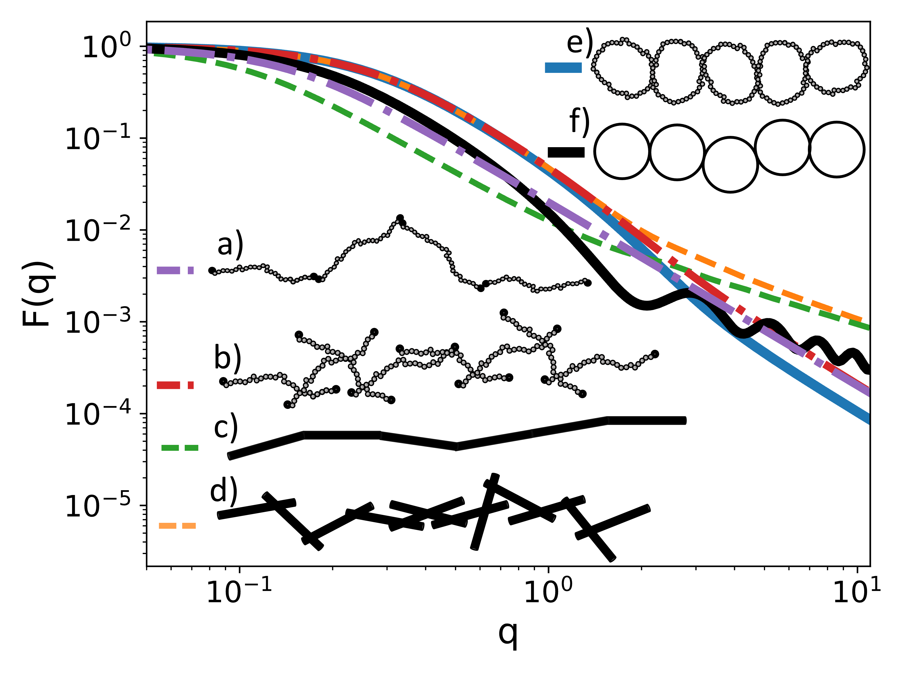
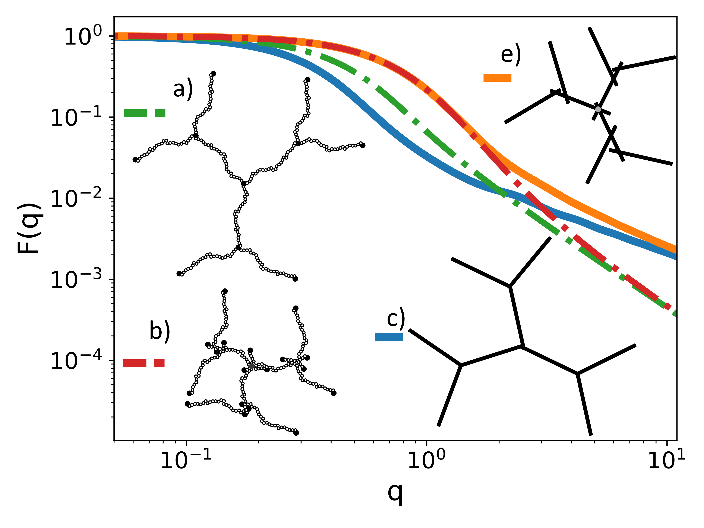
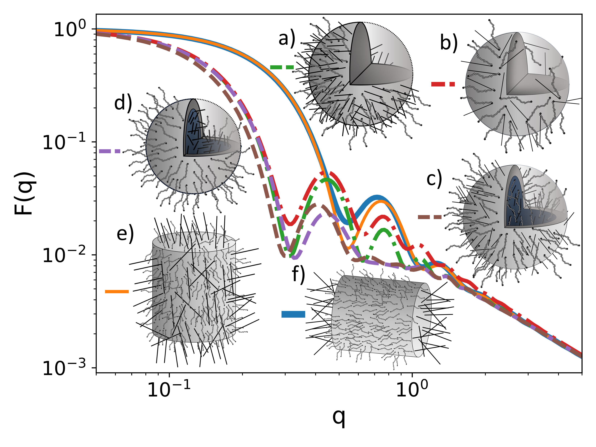
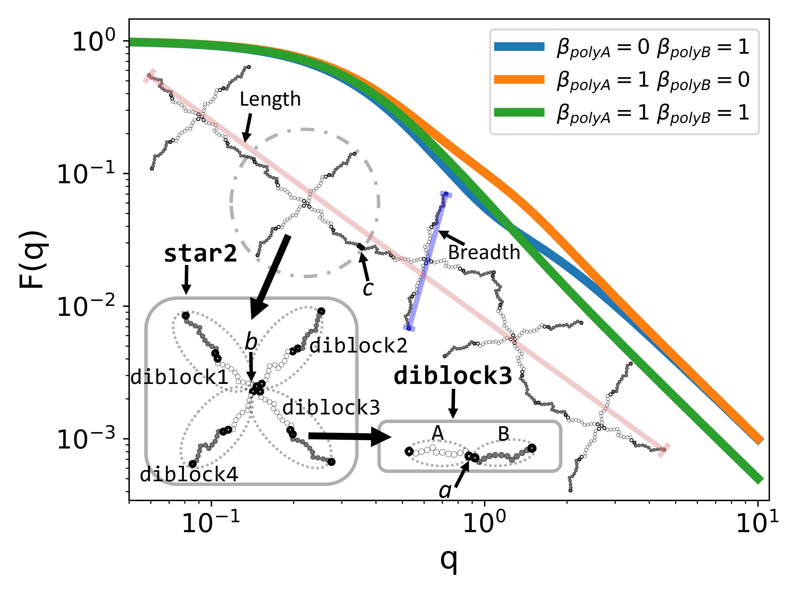

# Scattering Equation Builder - SEB

*SEB is a C++ library where one can build a structure by linking sub-units such as polymers or geometric shapes together and then ask SEB to analytically derive a symbolic expression for the small angle scattering of the structure.*

## Introduction
SEB is a C++ library that allows you to build structures from sub-units such as spheres, polymers, rods, etc., and obtain their scattering properties symbolically. SEB provides functions that enable you to attach sub-units together at specific points called reference points, and compute the form factor of a composite structure, $F$, the radius of gyration, $R^2_g$, and other scattering properties relevant for structures in solution.

### Workflow
To give you a quick overview of how SEB works, imagine a structure that you want to build from the available sub-units. You can use SEB to write a short C++ program that defines the structure by creating and linking sub-units together, and generate the form factor as a symbolic equation. You can then plot the equation by substituting the symbols with numerical values. A typical work flow of SEB is shown in the following picture:


1. Here we imagine a star-polymer structure one can build from the given sub-units.
2. Using the SEB library, we write a small C++ program to build the structure by attaching GaussianPolymer sub-units to a central point.
3. End the code with calling ```cout << getFormFactor("PolymerStar") << endl``` to analytically calculate a symbolic expression for the form factor.
4. Graph the equation by substituting the symbols in the equation for specific values. 

### Supported Subunits


Overview of supported sub-units (SEB V1.0):
    **a)** a solid cylinder (SolidCylinder: center, hull, ends, surface),
    **b)** a solid sphere (SolidSphere: center, surface),
    **c)** a solid spherical shell (SolidSphericalShell: center, surfacei, surfaceo, surface),
    **d)** a thin spherical shell (ThinSphericalShell: center, surface),
    **e)** a thin disk (ThinDisk: center, surface, rim),
    **f)** a linear polymer (GaussianPolymer: end1, end2, middle, contour),
    **g)** a polymer loop (GaussianLoop: contour),
    **h)** a thin circle (ThinCircle: center, contour),
    **i)** a thin rod (ThinRod: end1, end2, middle, contour),
    **j)** an invisible point (Point: point). 
    For each sub-unit type, the parenthesis shows its SEB name and 
    reference points by which it can be linked to other sub-units.

### Example structures

| ---                        |  ---                      |
| ---                        |  ---                      |
|    |   |
|    |   |

Structures and form factors. **Top left image**) linear chains of different types of sub-units, **Top right image**) dendrimers of different types of sub-units, **bottom left image**) Rods and polymers attached to different surfaces on geometric bodies, and **bottom right image**) chain of 5 di-block copolymer stars and its form factor for three different contrasts. See the SEB paper for details and the [PaperFigs](https://github.com/Tobionecenobi/SEB/tree/main/PaperFigs) folder for the code to generate these.


### SEB Articles
The theory behind SEB can be found in the journal articles: Carsten Svaneborg, Jan Skov Pedersen, J. Chem. Phys. 136, 104105 (2012) "[A formalism for scattering of complex composite structures. I. Applications to branched structures of asymmetric sub-units](https://doi.org/10.1063/1.3682778)" and Carsten Svaneborg, Jan Skov Pedersen, J. Chem. Phys. 136, 154907 (2012) "[A formalism for scattering of complex composite structures. II. Distributed reference points](https://doi.org/10.1063/1.3701737)"

The reference for the SEB library itself is Tobias W. J. Jarrett and Carsten Svaneborg "[A computational tool for symbolic derivation of the small angle scattering from complex composite structures](https://doi.org/10.1107/S1600576724001729)", Journal of Applied Crystallography 57, 587 (2024). See below for Bibtex citations for these papers.

## SEB's wiki
If you need API information or want more examples than below on how to use SEB please see the [wiki](https://github.com/Tobionecenobi/SEB/wiki) (still under construction).

## Dependencies

SEB has only been compiled on linux systems and has not been tested on mac OS or Windows.  If you are using Windows, we recommend using the *Windows Subsystem for Linux* (WSL), search for it in the search bar. Before downloading the source code make sure you have installed

1. A working C++11 compliant compiler.
2. A standard development environment with make and git. 
3. The [GiNaC](https://www.ginac.de/Download.html) symbolic manipulation library for C++
4. The [GNU scientific Library](https://www.gnu.org/software/gsl/) 

## Installing

### SEB on Linux (Ubuntu)

### Install dependencies

Ubuntu:
```
sudo apt update
sudo apt install libcln-dev libgsl-dev libginac-dev
```

This will install the GNU scientific library and GiNaC package along with their dependencies.

> [!TIP]
> **If you have problems installing GiNaC:**
> If you have trouble installing GiNaC you can try to build GiNaC from scratch. To do this see following guide in [SEB's wiki](https://github.com/Tobionecenobi/SEB/wiki/Installing-SEB:-Guide-for-GiNaC-and-GSL-Dependencies).

> [!TIP]
> **Another tip for installing GiNaC is to:**
>
> **1)** clone the cln library `git clone git://www.ginac.de/cln.git` and **read the INSTALL\* files.**
>
> **2)** clone the GiNaC library `git clone git://www.ginac.de/ginac.git` and again **read the INSTALL\* files**.
>
> There are guides for installing using cmake or installing on windows for both libraries.

### Cloning the GIT code

You can clone the source code in the terminal using
```
git clone https://github.com/Tobionecenobi/SEB.git
```
this will create a SEB folder in the current working directory and download the source code into this folder.


### Installing SEB on Windows (using WSL)

[Windows Subsystem for Linux](https://learn.microsoft.com/en-us/windows/wsl/about) (WSL)
allows you to install a virtual machine running e.g. Ubuntu. In that case you can use
the Linux installation guide above.

### Installing SEB on Windows (using MSYS2)

See the guide [Lau Blom Grøndahl](https://lag-science.com/sebonwindows.html)   You may experience that the C++ compiler and make are not included by default.

## Installing SEB on Mac (using brew)

Thanks to Andreas Haar Larsen / Caolan Browne for help here.

In a terminal do:

'''
brew install cln
brew install gsl
brew install ginac
'''

Install SEB as above
```
git clone https://github.com/Tobionecenobi/SEB.git
```

This creates a sub-folder SEB in which you find the source code. Before you can compile SEB you need to find the location of the GiNaC include files.

'''
find /opt/homebrew -name ginac.h
'''

If it returns "/opt/homebrew/Cellar/ginac/1.8.7/include/ginac/ginac.h" then you should edit SEB/makefile and the INC line should be changed to
'''
INC=-I/opt/homebrew/Cellar/ginac/1.8.7/include/
'''

Then you are ready to compile SEB.

### Compiling

Assuming you git cloned into the folder SEB, then

```
cd SEB
make
```

will compile the SEB library (into build/libseb.a), along with all the examples (in Examples), code for generating figures in the SEB paper (in PaperFigs). Assuming everything went well, then Examples and PaperFigs will be full of executables which you can run to see how SEB works. These targets can be recompiled individually by calling make with "seb", "examples", "paperFigs", or "work" as an argument. The last argument compiles user own code in the work folder, which is empty when you clone the repo.

### Running an example

```
cd Examples
./Micelle     (or Micelle.exe on windows).
```


This example calculates the scattering from 100 Gaussian polymers added to the surface of a solid sphere, in particular, the form factor, the form factor amplitude relative to the center, and the phase factor between two free polymer ends. The output of the program is

```
Form factor= \frac{9900 \frac{ \sin( R_{sphere} q)^{2} {(-1+\exp(- R_{g_{poly}}^{2} q^{2}))}^{2} \beta_{poly}^{2}}{ R_{sphere}^{2} R_{g_{poly}}^{4} q^{6}}+200 \frac{ \beta_{poly}^{2} {(-1+ R_{g_{poly}}^{2} q^{2}+\exp(- R_{g_{poly}}^{2} q^{2}))}}{ R_{g_{poly}}^{4} q^{4}}-600 \frac{ \beta_{sphere} \sin( R_{sphere} q) {(-1+\exp(- R_{g_{poly}}^{2} q^{2}))} \beta_{poly} {(\sin( R_{sphere} q)- R_{sphere} \cos( R_{sphere} q) q)}}{ R_{sphere}^{4} R_{g_{poly}}^{2} q^{6}}+9 \frac{ \beta_{sphere}^{2} {(\sin( R_{sphere} q)- R_{sphere} \cos( R_{sphere} q) q)}^{2}}{ R_{sphere}^{6} q^{6}}}{\beta_{sphere}^{2}+10000 \beta_{poly}^{2}+200  \beta_{sphere} \beta_{poly}}

Form factor amplitude relative to centre= -\frac{100 \frac{ \sin( R_{sphere} q) {(-1+\exp(- R_{g_{poly}}^{2} q^{2}))} \beta_{poly}}{ R_{sphere} R_{g_{poly}}^{2} q^{3}}-3 \frac{ \beta_{sphere} {(\sin( R_{sphere} q)- R_{sphere} \cos( R_{sphere} q) q)}}{ R_{sphere}^{3} q^{3}}}{\beta_{sphere}+100 \beta_{poly}}

Phase factor tip-to-tip= \frac{ \sin( R_{sphere} q)^{2} \exp(-2  R_{g_{poly}}^{2} q^{2})}{ R_{sphere}^{2} q^{2}}
```

Here ```R_{sphere}``` is the radius of the sphere, ```\beta_{sphere}``` the excess scattering length of the sphere, ```R_{poly}``` is the radius of gyration of the polymer, and ```\beta_{poly}``` is its excess scattering length. All scattering expressions are normalized so they converge to unity in the q->0 limit.

LaTeX produce the following rendering of the form factor expression:
$$\frac{9900 \frac{ \sin( R_{sphere} q)^{2} {(-1+\exp(- R_{g_{poly}}^{2} q^{2}))}^{2} \beta_{poly}^{2}}{ R_{sphere}^{2} R_{g_{poly}}^{4} q^{6}}+200 \frac{ \beta_{poly}^{2} {(-1+ R_{g_{poly}}^{2} q^{2}+\exp(- R_{g_{poly}}^{2} q^{2}))}}{ R_{g_{poly}}^{4} q^{4}}-600 \frac{ \beta_{sphere} \sin( R_{sphere} q) {(-1+\exp(- R_{g_{poly}}^{2} q^{2}))} \beta_{poly} {(\sin( R_{sphere} q)- R_{sphere} \cos( R_{sphere} q) q)}}{ R_{sphere}^{4} R_{g_{poly}}^{2} q^{6}}+9 \frac{ \beta_{sphere}^{2} {(\sin( R_{sphere} q)- R_{sphere} \cos( R_{sphere} q) q)}^{2}}{ R_{sphere}^{6} q^{6}}}{\beta_{sphere}^{2}+10000 \beta_{poly}^{2}+200  \beta_{sphere} \beta_{poly}}
$$

This looks pretty horrific because GiNaC does not attempt to simplify expressions, but it has the advantage that we can immediately provide a physical interpretation of all the terms. The terms in the numerator describe 1) the polymer-to-polymer interference contribution, 2) the single polymer Debye form factor, 3) the polymer-to-core interference contribution, 4) the Rayleigh form factor of the core. The numerator is the total excess scattering length squared hence its just $\left(100 \beta_{poly}+\beta_{sphere}\right)^2$.

The [example folder](https://github.com/Tobionecenobi/SEB/tree/main/Examples) has numerous other examples, most of which produce symbolic expressions. These can become very long. The code to generate all the figures from the SEB paper is located in [PaperFigs](https://github.com/Tobionecenobi/SEB/tree/main/PaperFigs). We have uploaded png plots of the figures with illustrations of the structures. For each curve, there is a corresponding C++ file that generates that structure and its scattering curve.

## Validation

To ensure that all the sub-unit scattering expressions implemented in SEB are correct. We have validated the code and theory as follows.
### Sampling Scattering Profiles for Complex Geometries
For more complex geometries, we have sampled the scattering profiles directly. We generate random points on the surface and internally in the geometry. Based on these points we have used the Debye formula to calculate the scattering form factors between pairs of scatterers inside the geometry, form factor amplitudes between internal points and reference points, and finally the phase factors between all pairs of reference points. Here reference points in the example of a solid spherical shell would be the centre, the internal surface, the external surface and the total surface. This gives a relatively large number of synthetic scattering files for each geometry. (Code+data in [Mathematica/Sampled](https://github.com/Tobionecenobi/SEB/tree/main/Mathematica/Sampled))
### Analytical Derivation and Comparison with Synthetic Data
We have used Wolfram Mathematica to derive analytic expressions for the sub-units (Code in Mathematica/*.nb). Where relevant these expressions have been compared the synthetic data to ensure that all expressions derived by Mathematica match the sampled data within the statistical accuracy of our sampling. At this stage we can trust that theoretical expressions match the synthetic scattering data.
### Implementation in SEB
To implement sub-units in SEB, we have exported the Mathematica expressions to C++ either manually or using CForm[expression]. The resulting expresions are in sub-unit header files in the [SEB/Subunits folder](https://github.com/Tobionecenobi/SEB/tree/main/SEB/Subunits), where each header file is a specific sub-unit geometry. We also generate Guinier expansions of all scattering expressions to obtain size expressions for $\langle Rg^2 \rangle$ for the form factor, and $\sigma\langle R^2 \rangle$ for form factor amplitudes and phase factors. The size expressions are also exported to the C++ code. The ```SubUnit->ValidateDefinedTerms()``` method checks that all scattering terms and size terms are defined for the reference points combinations for a sub-unit.
### Validation of Mathematical Correctness
Finally, to ensure that the scattering terms not only exist but are also mathematically correct, we have taken the following steps:
1. **Generation of Theoretical Scattering Data**: Using Mathematica, we have created tabulated theory scattering curves for each scattering expression. This data, devoid of statistical sampling errors, can be found in the [Examples/Validate subfolders](https://github.com/Tobionecenobi/SEB/tree/main/Examples/Validation).
2. **Numerical Evaluation and Comparison**: Each scattering expression has been numerically evaluated at the same q-values as those used in the Mathematica-generated curves. We then compared the results from these numerical evaluations with the theoretical data. To ensure precision, we've set a tolerance level of $10^{-4}$ for the systematic error on the evaluation of the special functions. Scattering expressions showing deviations larger than this tolerance are flagged for review and potential correction.

By following these steps, we aim to guarantee that our mathematical formulations in SEB are not only theoretically sound but also practically applicable and accurate.
### Checking Guinier Expansions
To check the Guinier expansions e.g. of a form factor amplitude, we predict the scattering from the Guinier expansion $A_{\text{Guinier}}(q)= 1- q^2 \sigma \langle R^2\rangle/6$, where an size expression for $\sigma \langle R^2 \rangle$ is hard-coded for each reference point. Where the second term is $<0.01$ we compare $A_\text{Guinier}(q)$ to the scattering data generated by Mathematica. These should also match within the accuracy of a tolerance, that again we choose as $10^{-4}$. Size expressions with larger deviations are flagged as bugs that needs to be fixed.
### Additional Checks with GiNaC
For some of the sub-unit expressions but not all, we can also use GiNaC to expand the scattering terms directly as a Taylor series around $q=0$. That automatically generates the size expressions. In that case we perform a term-by-term comparison with the 1,0, $2 \langle Rg^2 \rangle$ for form factors or 1, 0, $\sigma\langle R^2 \rangle$ for form factor amplitudes and phase factors to check that the expressions match. This does not work for special functions, where GiNaC does not know the Series expansions. The comparison also fails for expressions that are sufficiently complicated so even though $A==B$ GiNaC is not able to simplify $A-B$ to zero and hence prove their identity.


## Using SEB in your own C++ Code

To use SEB you can either **1)** develop code in the SEB/work folder  or **2)** develop code anywhere on your computer. Option 1 allows you to reuse the SEB compilation infrastructure and no installation of SEB is required. Option 2 requires the user to manually compile the code specifying where SEB header files and library is located.

### Example source code

To derive the scattering for a diblock copolymer created by linking two Gaussian polymer models end-to-end, we do
```
#include "SEB.hpp"

int main()
{
    // Define world
    World w;

    // Add a single polymer, named 'poly1'
    GraphID g = w.Add("GaussianPolymer", "poly1");

    // Add a second polymer, named 'poly2'. Poly2's end1 is linked to poly1's end2 forming a diblock copolymer
    w.Link("GaussianPolymer", "poly2.end1", "poly1.end2");

    // Wrap the g structure naming it "diblockcopolymer"
    GraphID g2 = w.Add(g, "diblockcopolymer");

    // Request the symbolic expression for the form factor of this structure
    ex formFactor=w.FormFactor("diblockcopolymer");

    // Print out form factor expression
    cout << formFactor << endl;

    // Request LaTeX formatted output
    cout << latex;

    // Print out LaTeX expression for form factor
    cout << formFactor << endl;
}
```

The output is
```
2*(beta_poly1^2+beta_poly2^2+2*beta_poly2*beta_poly1)^(-1)*(beta_poly2^2*Rg_poly2^(-4)*q^(-4)*(-1+exp(-Rg_poly2^2*q^2)+Rg_poly2^2*q^2)+q^(-4)*(-1+q^2*Rg_poly1^2+exp(-q^2*Rg_poly1^2))*Rg_poly1^(-4)*beta_poly1^2+beta_poly2*Rg_poly2^(-2)*q^(-4)*Rg_poly1^(-2)*(-1+exp(-Rg_poly2^2*q^2))*beta_poly1*(-1+exp(-q^2*Rg_poly1^2)))

2 \frac{\frac{ \beta_{poly2}^{2} {(-1+\exp(- R_{g_{poly2}}^{2} q^{2})+ R_{g_{poly2}}^{2} q^{2})}}{ R_{g_{poly2}}^{4} q^{4}}+\frac{ {(-1+ q^{2} R_{g_{poly1}}^{2}+\exp(- q^{2} R_{g_{poly1}}^{2}))} \beta_{poly1}^{2}}{ q^{4} R_{g_{poly1}}^{4}}+\frac{ \beta_{poly2} {(-1+\exp(- R_{g_{poly2}}^{2} q^{2}))} \beta_{poly1} {(-1+\exp(- q^{2} R_{g_{poly1}}^{2}))}}{ R_{g_{poly2}}^{2} q^{4} R_{g_{poly1}}^{2}}}{\beta_{poly1}^{2}+\beta_{poly2}^{2}+2  \beta_{poly2} \beta_{poly1}}
```
where the top line is the symbolic expression in the default format, and the bottom expression is formatted according to LaTeX. Rendinger the equation in LaTeX we get the following


Again we can interpret the physical origin of the three terms in this expression. The terms in the numerator are **1)** the Debye form factor of poly2, **2)** the Debye form factor of poly1, and **3)** the interference contribution between scatterers on poly1 and scatterers on poly2. The numerator is the total excess scattering length squared which is given by $(\beta_{poly1}+\beta_{poly2})^2$. 

## Compiling 

To compile the code depends on where your code is located

## SEB/work folder

```
make work
```
Running this command in the SEB parent folder will compile and link user C++ code in the work folder using the SEB compile infrastructure. The resulting executable is placed in the SEB/work folder.

### Elsewhere

Assuming your code is in code.cpp then you can compile and link your code manually with
```
c++ -O2 -c -IFOLDER/SEB/SEB code.cpp
c++  code.o  -lseb -lgsl -lgslcblas -lm -lginac -LFOLDER/SEB/build  -o myexecutable
```
where the user manually has to specify the location of the header files (FOLDER/SEB/SEB/ is the folder where SEB.hpp is located) and the library (FOLDER/SEB/build/ is the folder where libseb.a is located), where you should modify FOLDER to fit your local environment. Note its important the object file is specified before the libraries when compiling.

## Contributing

SEB is Open Source and we wellcome contributions from users. Each time a new sub-unit or even just a new reference point is added to SEB the library of structures that can be generated by SEB grows exponentially. For adding code for new sub-units, please provide the code along with validation code following our protocol above or better. Ideally we would also like to include the mathematical derivation of the scattering expressions within SEB for future documentation.

## Bibtex

```
@article{svaneborg2012formalism1,
  title={A formalism for scattering of complex composite structures. {I}. {A}pplications to branched structures of asymmetric sub-units},
  author={Svaneborg, Carsten and Pedersen, Jan Skov},
  journal={J. Chem. Phys.},
  volume={136},
  number={10},
  pages={104105},
  year={2012},
  publisher={AIP Publishing},
  doi={10.1063/1.3682778},
  url={http://doi.org/10.1063/1.3682778}
}

@article{svaneborg2012formalism2,
  title={A formalism for scattering of complex composite structures. {II}. {D}istributed reference points},
  author={Svaneborg, Carsten and Pedersen, Jan Skov},
  journal={J. Chem. Phys.},
  volume={136},
  pages={154907},
  year={2012},
  publisher={AIP Publishing},
  doi={10.1063/1.3701737},
  url={http://doi.org/10.1063/1.3701737}
}

@article{Jarrett2024SEB,
  title={{S}{E}{B}: a computational tool for symbolic derivation of the small-angle scattering from complex composite structures},
  author={Jarrett, Tobias William Jensen   and Svaneborg, Carsten}
  journal={J. Appl. Crystallogr.},
  volume={57},
  pages={587},
  year={2024},
  publisher={IUCL},
  doi={10.1107/S1600576724001729},
  url={http://doi.org/10.1107/S1600576724001729}
}

